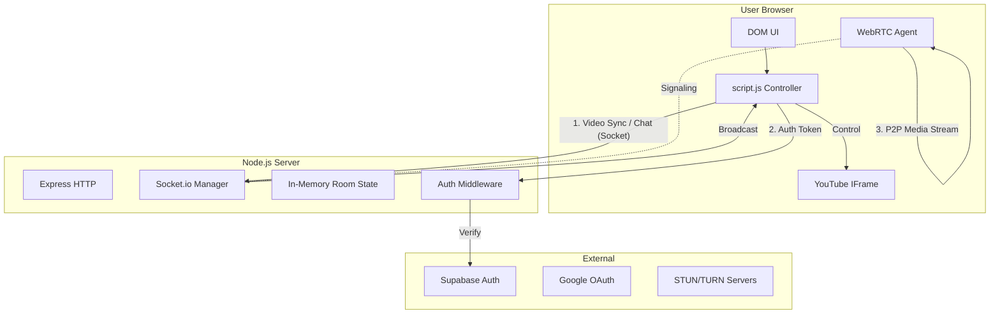

# Production Readiness Audit & Technical Documentation

**Generated by:** System Architect Agent  
**Date:** 2026-02-14  
**Version:** 1.0.0 (Pre-Launch)

---

## 1. High-Level System Overview

**SyncTube** is a real-time collaborative watch-party application allowing distributed users to watch YouTube videos in perfect synchronization while video chatting.

### Problem Solved
Friends want to watch movies/videos together remotely but struggle with manually syncing playback ("3, 2, 1, press play"). SyncTube automates this synchronization and integrates social features (chat, video calls) into a single browser interface.

### User Journey
1.  **Auth**: User signs in with Google (Supabase) to establish identity.
2.  **Room Creation**: User generates a unique room ID and shares the link.
3.  **Join**: Friends click the link, authenticate, and connect via WebSocket.
4.  **Sync**: Host selects a video. Play/pause/seek events are broadcast instantly to all peers.
5.  **Social**: Users chat via text or launch a peer-to-peer WebRTC video call for face-to-face interaction while watching.

---

## 2. Technology Stack Breakdown

### Frontend (Client)
-   **Core**: Vanilla HTML5 / CSS3 / ES6+ JavaScript. No framework overhead (React/Vue) — optimal for low-latency DOM updates.
-   **Video Player**: YouTube IFrame Player API (managed via `window.YT`).
-   **State**: Custom event-driven state machine (`script.js`) handling sync diffs and UI updates.
-   **Styling**: Pure CSS with CSS Variables for theming.
-   **Icons**: Lucide Icons (via CDN).

### Backend (Server)
-   **Runtime**: Node.js utilizing `express` for HTTP serving.
-   **Real-Time Engine**: `socket.io` (v4.8) for low-latency event broadcasting.
-   **Auth Integration**: `@supabase/supabase-js` for verifying tokens on socket connection.
-   **Validation**: Custom "Lenient Validation" logic to sanitise inputs without crashing sessions.

### Auth & Database
-   **Provider**: Supabase (Google OAuth).
-   **Flow**: Client authenticates → receives JWT → passes JWT to Socket.io handshake → Server verifies JWT → Connection established.
-   **Database**: Supabase PostgreSQL (used only for User Profiles; Room state is currently **in-memory**).

### Deployment
-   **Platform**: Render (Auto-deploy from Git).
-   **Environment**: Stateless Node.js container.
-   **Config**: Environment variables for `SUPABASE_URL`, `SUPABASE_ANON_KEY`.

---

## 3. Architecture Diagram



---

## 4. Data Flow Diagrams (DFD)

### Level 1: Room Join & Auth
```text
[User] -> (Click Login) -> [Supabase]
                           |
                           v
                       (Return JWT)
                           |
[Script.js] -> (Connect Socket + JWT) -> [Server Middleware]
                                              |
                                          (Verify User) -> [Supabase]
                                              |
                                          [Server Memory] -> (Create/Update Room)
                                              |
                                          (Emit 'room-state') -> [Script.js]
```

### Level 1: Video Synchronization
```text
[User A] -> (Seek Video) -> [Script.js]
                                |
                           (Emit 'sync-action')
                                |
                            [Server]
                           /        \
                    (Validate)    (Rate Limit)
                         |             |
                   [Update State] -> (Broadcast 'sync-update')
                                         |
                                    [User B Script.js]
                                         |
                                    (Calculate Drift > 0.5s?) --Yes--> [Seek Player]
```

---

## 5. State Management Analysis

### Server-Side State
-   **Storage**: Javascript Object in heap memory (`const rooms = {}`).
-   **Persistence**: **Ephemeral**. All room data (current video, timestamp, paused state) is lost if the server restarts or deploys.
-   **Concurrency**: Single-threaded Event Loop (Node.js). Safe from race conditions within a single instance.
-   **Scaling**: State is local to the instance. Does not support multi-replica scaling without Redis adapter (currently not implemented).

### Client-Side State
-   **Session**: `localStorage` holds `synctube_session` (Supabase).
-   **Runtime**: `script.js` variables (`player`, `roomId`, `isMicEnabled`, `isHardSyncing`).
-   **Recovery**: On page reload, application re-authenticates via Supabase session and re-joins socket using URL param `?room=XYZ`.

---

## 6. Real-Time Sync & WebRTC Logic Deep Dive

### Sync Model: "Friendly Consensus"
-   **Authority**: **Mixed**. 
    -   `change-video`: **Host Only** (Strict).
    -   `sync-action` (Play/Pause/Seek): **Open** (Friendly). Any user can control playback.
-   **Drift Handling**: **Simple Correction**.
    -   Tolerance: `0.5 seconds`.
    -   Logic: If `|localTime - serverTime| > 0.5s`, force seek to server time. Otherwise, ignore to prevent stutter.
-   **Hard Sync**: A dedicated "Global Reset" button that pauses everyone, seeks to the clickable user's time, waits 800ms for buffering, then resumes.

### WebRTC Implementation
-   **Topology**: **Mesh** (Peer-to-Peer).
-   **Signaling**: Server acts as a relay for `offer`, `answer`, and `ice-candidate` packets. Server stores *no* media.
-   **Reconnects**: Auto-recovery logic handles temporary internet dropouts.
    -   `socket.on('connect')` triggers `vc-reconnect`.
    -   Peers hold connection state and attempt renegotiation locally.

---

## 7. Security Audit

| Component | Status | Finding | Recommendation |
| :--- | :---: | :--- | :--- |
| **XSS / DOM** | ✅ Safe | No `innerHTML` used for user inputs. Safe `textContent` used everywhere. | Keep using `createElement` patterns. |
| **Authentication** | ✅ Safe | Socket connection rejected without valid Supabase JWT. | Rotate Supabase keys periodically. |
| **Validation** | ⚠ Standard | Lenient validation log & drop. | Add specific type checks for JSON payloads. |
| **Rate Limiting** | ✅ Safe | Soft limits (3 sync/sec, 2 chat/sec) per socket. | Sufficient for MVP. |
| **Room Abuse** | ⚠ Risk | Room IDs are user-defined strings if manually entered. | Enforce server-side UUIDs for new rooms. |
| **Data Leakage** | ✅ Safe | Server only relays signaling messages to specific room. | Ensure `socket.join` is strictly gated. |

---

## 8. Performance & Scalability Review

-   **Memory**: Room objects are lightweight (~200 bytes per room). 1000 active rooms ≈ < 10MB heap usage. Excellent.
-   **CPU**: Main bottleneck is JSON serialization/deserialization frequency.
    -   *Risk*: If 50 users spam seekbar, broadcast storm (50 * 50 = 2500 events/sec) could saturate CPU.
    -   *Mitigator*: Rate limiter drops excess events.
-   **Limits**:
    -   `MAX_ROOMS = 1000` (Hard cap).
    -   `MAX_USERS_PER_ROOM = 50` (Hard cap).
-   **Cold Start**: Render Free Tier spins down after 15m inactivity. First request will take ~50s.
    -   *Impact*: User sees "Connection Error" initially.

---

## 9. Production Readiness Checklist

-   [x] **Core Functionality**: Sync, Chat, Video Call all functional.
-   [x] **Security**: XSS patched, Auth enforced.
-   [x] **Stability**: Reconnect logic implemented.
-   [x] **Constraint**: Deployment ready for Render.
-   [ ] **Persistence**: Rooms vanish on deploy (Acceptable for v1).
-   [ ] **Scalability**: Limited to 1 server instance (Acceptable for <5k users).

**Is this deployable today?** **YES**.

---

## 10. Risk Matrix

| Risk Scenario | Severity | Impact | Likelihood | Fix Priority |
| :--- | :---: | :--- | :---: | :---: |
| Server Restart (Deploy/Crash) | Medium | All active rooms deleted. Users must re-create. | Low (Planned) | v2 |
| Global Chat Spam | Low | Local client lag. | Low (Rate Limited) | Backlog |
| YouTube API Quota / Block | High | Playback fails for all users. | Rare | Monitor |
| WebRTC Connection Failure | Medium | Video call fails (firewall/corp network). | Medium | Add TURN |

---

## 11. Observability & Monitoring Gaps

**Current State**:
-   `console.log` for events.
-   `/health` JSON endpoint.

**Gaps**:
-   No centralized logging (logs die with container).
-   No client-side error reporting (Sentry).
-   No alerts for "High Error Rate".

**Recommendation**: Attach a basic uptime monitor (UptimeRobot) to `/health` to track freezes.

---

## 12. Final Verdict

### Production Readiness Score: **8/10**

The system is solid, secure, and performant for a "Launch & Learn" stage. It is architected correctly for its scale (monolithic Node.js + P2P WebRTC). The primary limitations (memory state, single node) are strategic tradeoffs that simplify operations.

### Launch Recommendation
**GO FOR LAUNCH.** 🚀

### Next 5 Engineering Actions (Post-Launch)
1.  **Add TURN Server**: To support users behind strict corporate firewalls (WebRTC fix).
2.  **External State (Redis)**: Move `rooms` to Redis to survive server restarts.
3.  **Client Error Tracking**: Add Sentry to frontend to catch browser-specific crashes.
4.  **Admin Dashboard**: Simple view to kill zombie rooms or ban users.
5.  **Room URL UUIDs**: Auto-generate cryptographically secure room IDs instead of user strings.
